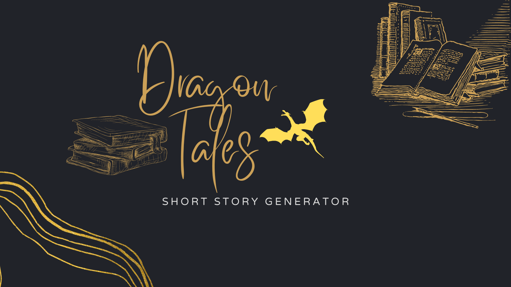

# Dragon Tales - Short Story Generator 🐉📚



Welcome to Dragon Tales, a powerful and user-friendly short story generator! 

Access the website here : [Dragon Tales](http://35.224.204.110/)

Back-end spring boot code is available in: the `Backend-SpringBootApplication.zip` file.

Demo : [Dragon Tales Walkthrough](https://youtu.be/isWk6O8Fc-c)

## Table of Contents

1. [About the Project](#about)
2. [Features](#features)
3. [Benefits](#benefits)
4. [Getting Started](#getting-started)
5. [Contributing](#contributing)

<a name="about"></a>

# Dragon Tales 🐉📚

## Inspiration
The inspiration for Dragon Tales came from our innate love for stories and the magic they bring into our lives. We believe in the power of storytelling and its ability to ignite imagination, foster learning, and inspire. With advancements in AI and language models, we envisioned leveraging this technology to bring to life an application that could generate diverse and captivating tales, crafted uniquely for every user.

## What it does
Dragon Tales is a unique storytelling platform that harnesses the power of OpenAI's ChatGPT. Our application presents users with an array of stories across various genres. It utilizes a Spring Boot application to interface with the ChatGPT API, which generates the stories.

One key feature is the ability to mark stories as favorites, allowing users to revisit their preferred tales with ease. We also offer a filtering option to sort stories by genre, and the ability to read the story aloud, making the application more accessible and user-friendly. Dragon Tales can serve as a platform for a wide range of users, from children seeking fantastical tales to adults looking for a brief escape into a world of adventure.

## How we built it
Our platform was built using Streamlit for the frontend, enabling us to create an interactive, user-friendly interface. The backend is a Spring Boot application that interacts with the ChatGPT API. We used pandas to manage and manipulate our data efficiently and provide features like filtering and favoriting. The text-to-speech feature was implemented using Google's Text-to-Speech (gTTS) library.

## Challenges we ran into
As with any project that employs leading-edge technology, we encountered several challenges along the way. Integrating the ChatGPT API with our Spring Boot application required rigorous testing and adjustments to ensure seamless communication. We also had to make sure the generated stories were of high quality and diverse in nature, which required fine-tuning and calibration.

## Accomplishments that we're proud of
We're proud of the platform we've built, providing users with a versatile tool for discovering and enjoying AI-generated stories. The successful integration of the ChatGPT API with our application and the addition of the favorite and filter functions are significant milestones. We're also pleased with the application's user-friendly design and the accessibility offered by the 'read aloud' feature.

## What we learned
In the process of building Dragon Tales, we learned how to harness the power of AI for creative storytelling. We delved into the workings of the ChatGPT API, gained valuable experience working with Streamlit, and further developed our skills in Python and Spring Boot. This project also honed our problem-solving abilities and reiterated the importance of user-focused design.

## What's next for Dragon Tales?
The future for Dragon Tales is bright and full of potential. We aim to introduce more features such as a personalized recommendation system based on user preferences and history, multi-language support for diverse accessibility, and a community feature for users to share and discuss their favorite tales. As AI and language models continue to evolve, so will Dragon Tales, bringing more magic, more stories, and more adventures to our users.

<a name="features"></a>
## Features

1. **Generate Short Stories** - Create unique short stories just with a click of a button.

2. **Filtering Capabilities** - Search and filter your generated stories by genre.

3. **Favourites** - Mark any story as your favourite for quick access in the future. Easily add and remove stories from your favorites.

4. **Read Aloud** - Generates an audio file to read the stories aloud.


<a name="benefits"></a>
## Benefits

- **Creativity Boost** - Dragon Tales offers a limitless pool of stories that can help inspire writers and fuel their creativity.

- **Educational Tool** - It can be used as a tool to engage students in classrooms, making learning more interactive and enjoyable.

- **Reading Anytime, Anywhere** - With the download and read aloud features, enjoy your unique stories wherever you go, even without internet access.

<a name="getting-started"></a>
## Getting Started

To get a local copy up and running, follow these steps:

1. Clone the repository
```sh
git clone https://github.com/your_username_/Project-Name.git
```
2. Install the required libraries mentioned in the `requirements.txt`
```sh
pip install -r requirements.txt
```
3. Run the Streamlit app
```sh
streamlit run Home.py
```
<a name="Design"></a>
## System Design

The entire system is divided into 2 microservices.
- The Front End Streamlit Python application
- The Back End Springboot Java application

The backend utilises the Open AI chatGPT API services and the power of MongoDB Atlas to provide a seamless experience to the user.

Where as the front end UI is powered by Streamlit UI and the entire communication is happening through the dedicated API service of Dragon Tales.

The entire microservices are deployed and manged by Google Cloud services and Google Kuberenetes Engine.


The entire API documentation is available at : [Dragon Tales API docs](https://mongo-gcp-project.uc.r.appspot.com/swagger-ui/index.html#)
<a name="contributing"></a>
## Contributing

We welcome contributions.

Happy Reading with Dragon Tales 📖!

Made by Team Inevitables
